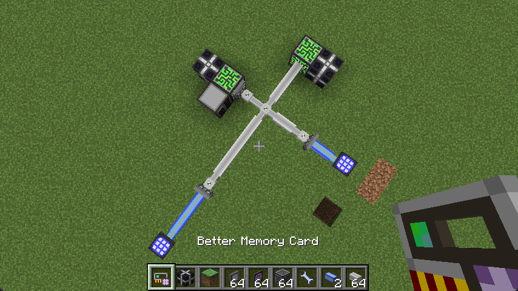

# 基本使用

本章将手把手教您使用这个强大的工具。

## 合成

使用应用能源2的内存卡和网络工具进行无序合成，你就可以得到一个强化内存卡。整合包中的合成可能会被魔改。

## 查看一个网络

使用强化内存卡右键一个 ME 网络设备或者 ME 线缆，便可以查看该网络中的 P2P 设备。

工具的主界面展示了该 ME 网络中的所有 P2P 设备，你可以在这个界面对这些 P2P 设备进行编辑。

## 示例：建立 P2P 通道

我们来展示一个例子。我们想将两个蓝色线缆的 ME 网络通过 P2P 连接起来。

显然我们想将这两个 P2P 一个设为输入一个设为输出，这样就可以建立一个 P2P 网络。只需要右键一个 P2P 设备，界面中就会自动选择这个设备，你也可以通过点击“选择”按钮来手动选择它。

界面中已选择的设备被涂为绿色。我们将模式改为“绑定输出”，点击要作为输出的 P2P 设备上的“绑定”按钮（你可以绑定多个输出设备）。

工具自动生成了一个 P2P 频率并且把当前选择的设备设为输入模式，另外两个设备设为输出模式，并且我们的网络也像预期一样工作了。

## 预览功能

在你选择了一个**已配置频率**的 P2P 设备并退出界面后，它将会在世界中拥有一个绿色边框，同时同频率的 P2P 设备会拥有一个蓝色边框。这将帮助你寻找你的 P2P 设备。你可以拿着强化内存卡 Shift+右键空气 来清除这些边框。

如果你在强化内存卡的界面以外的地方修改了 ME 网络（比如打掉一些线缆），你可能需要重新使用强化内存卡选择 P2P 设备来保证边框渲染正确。

## 其他模式怎么用？

我们会在下面的章节中分别介绍强化内存卡的三种模式。