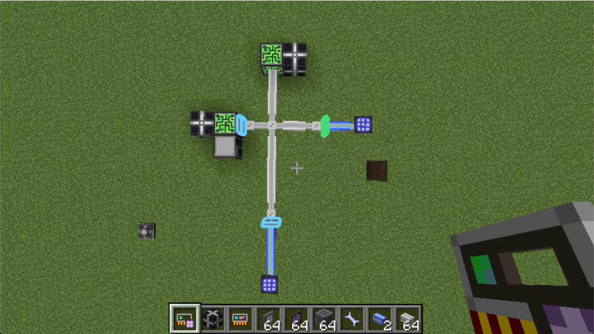

# 模式：绑定输出

在第一个章节中，我们建立了第一个 P2P 通道。然而在多数情况下我们需要对已有的 P2P 通道网络进行修改。强化内存卡提供了三种模式来应对这些情况。

首先，我们需要了解强化内存卡中“绑定”的工作原理。

## 何为绑定？

简单的来说，当你点击“绑定”按钮的时候，会分配一个 P2P 设备作为“输入”，另一个 P2P 设备作为“输出”。

若作为“输入”的 P2P 设备没有频率或者它本身为输出模式，它将会变为输入模式，并且会被分配一个新的频率。（类似于内存卡的Shift+右键）

之后作为“输出”的 P2P 设备将会被设为输出模式，并且设为同频率。我们就建立起了一个“输入”到“输出”的 P2P 通道。

如果想了解它背后的原理，你可以查看 [代码](https://github.com/LasmGratel/BetterP2P/blob/master/src/main/java/com/projecturanus/betterp2p/util/p2p/P2PUtil.kt#L13).

## 使用情景

我们想修改一下上一章中设立的简单网络，把右边的 P2P 设备设为输入，把下面的 P2P 设备作为输出。

我们只需要选择在右边的 P2P 设备，使用“绑定输出”模式找到并绑定在下面的 P2P 设备。

现在右边的 P2P 设备被分配了一个新频率并且被设为了输入模式。我们建立了一个仅限于蓝色线缆的独立 P2P 通道。
