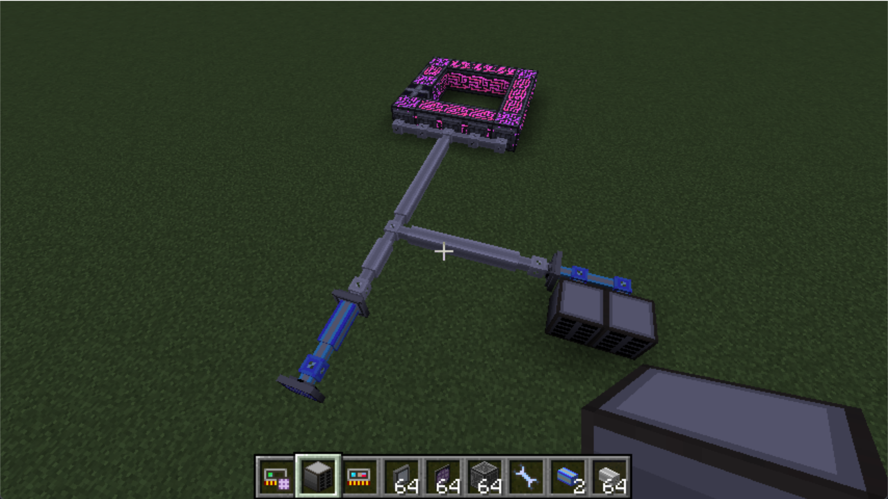
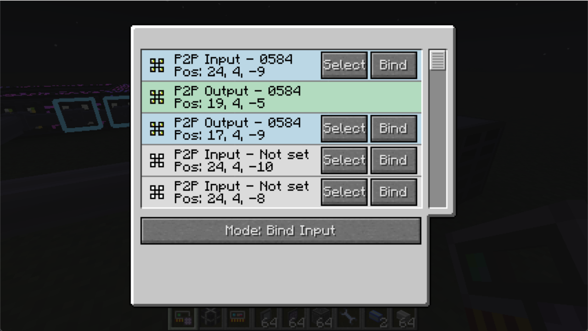

# 模式：绑定输入

将被绑定的 P2P 设备作为输入，已选择的 P2P 设备作为输出进行绑定。

## 使用情景

我们在 ME 控制器上贴了一堆 P2P 设备，我们现在想要在外面连接到这些设备。

你可能想要使用“绑定输出”模式，但是网络太复杂了，你找不到你要设置的输出 P2P 在哪里。这个时候我们可以选择对准蓝色线缆的一个 P2P 用“绑定输入”模式，绑定贴在 ME 控制器上的 P2P。在另一个 P2P 设备上也进行同样的操作。

现在我们设立了拥有一个输入，两个输出的 P2P 通道。
